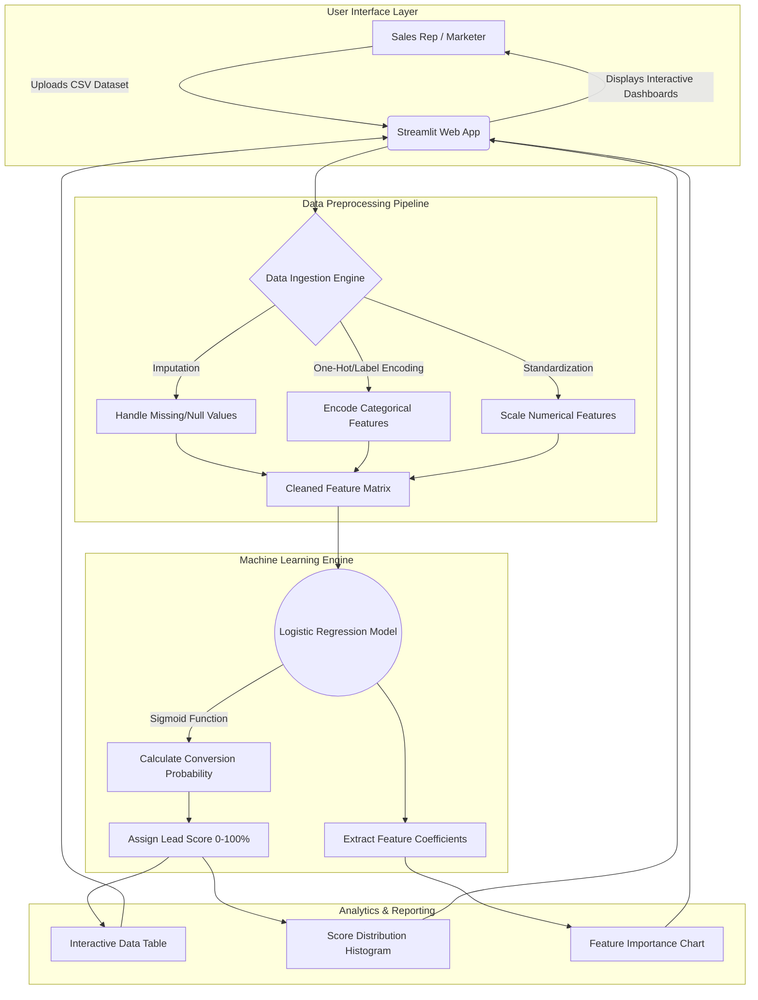

  <h1>🧠 LeadGen AI Enhancer</h1>
  <p><strong>An Enterprise-Grade, AI-Powered Lead Scoring & Analytics Platform</strong></p>

  <p>
    <a href="https://github.com/Rupeshbhardwaj002/LeadGen_AI_Enhancer/stargazers"></a>
    <a href="https://github.com/Rupeshbhardwaj002/LeadGen_AI_Enhancer/network/members"></a>
    <a href="https://github.com/Rupeshbhardwaj002/LeadGen_AI_Enhancer/issues"></a>
    <a href="https://github.com/Rupeshbhardwaj002/LeadGen_AI_Enhancer/blob/main/LICENSE"></a>
    
  </p>
</div>

---

## 📖 Executive Overview

In today's highly competitive market, sales and marketing teams often expend valuable resources pursuing low-probability prospects. **LeadGen AI Enhancer** bridges the gap between raw CRM data and actionable sales intelligence. 

Built on a robust **Streamlit** frontend and powered by a **Logistic Regression** machine learning engine, this application automatically ingests lead datasets, processes complex categorical and numerical features, and outputs a highly interpretable **Lead Conversion Probability Score (0-100%)**. By prioritizing leads with the highest propensity to convert, organizations can significantly optimize their sales funnel, reduce customer acquisition costs (CAC), and boost overall revenue.


<div align="center">
  


---

## 🏗️ System Architecture & Data Pipeline

The application follows a modular, scalable architecture designed for rapid data processing and real-time inference.



---

## ✨ Core Capabilities

### 🎯 1. Predictive Lead Scoring
- **Algorithmic Precision**: Utilizes Scikit-Learn's Logistic Regression to calculate the exact probability of a lead converting.
- **Dynamic Feature Detection**: Automatically identifies text-based (categorical) and numeric fields, applying the appropriate preprocessing transformations without manual intervention.

### 📊 2. Advanced Visual Analytics
- **Feature Importance Mapping**: Uncover the "Why" behind the scores. The app extracts model coefficients to display a bar chart of the top factors driving conversions (e.g., *Time spent on website*, *Lead Source*).
- **Distribution Histograms**: Visualize the health of your sales pipeline by seeing the distribution of lead scores across discrete probability buckets.

### 🎛️ 3. Interactive Data Management
- **Real-Time Filtering & Sorting**: Drill down into specific lead segments directly within the Streamlit UI.
- **One-Click Export**: Download the enriched dataset (appended with Lead Scores and probability metrics) as a CSV, ready for immediate import into Salesforce, HubSpot, or any standard CRM.

---

## 🛠️ Technology Stack

| Category | Technology | Description |
| :--- | :--- | :--- |
| **Frontend Framework** |  | Rapid web application development and interactive UI components. |
| **Machine Learning** |  | Core predictive modeling (Logistic Regression) and data preprocessing. |
| **Data Manipulation** |   | High-performance data structures, cleaning, and matrix operations. |
| **Data Visualization** |  | Generation of static, animated, and interactive visualizations. |

---

## 🚀 Installation & Local Setup

Follow these instructions to deploy the application in your local development environment.

### Prerequisites
- Python 3.8 or higher installed on your machine.
- Git installed for cloning the repository.

### 1️⃣ Clone the Repository
```bash
git clone https://github.com/Rupeshbhardwaj002/LeadGen_AI_Enhancer.git
cd LeadGen_AI_Enhancer
```

### 2️⃣ Configure a Virtual Environment
Isolating dependencies ensures that the application runs reliably without conflicting with other Python projects.

**For Windows:**
```bash
python -m venv venv
venv\Scripts\activate
```

**For macOS/Linux:**
```bash
python3 -m venv venv
source venv/bin/activate
```

### 3️⃣ Install Dependencies
```bash
pip install -r requirements.txt
```

---

## 💻 Comprehensive Usage Guide

1. **Initialize the Server**:
   ```bash
   streamlit run app.py
   ```
2. **Access the Dashboard**: Open your preferred web browser and navigate to `http://localhost:8501`.
3. **Data Ingestion**: 
   - Locate the file upload widget in the sidebar or main screen.
   - Drag and drop your historical lead dataset (must be in `.csv` format). Ensure the dataset contains a target column (e.g., `Converted`) if you are training, or standard feature columns for inference.
4. **Analyze Insights**: 
   - Review the **Lead Score Table** to see individual prospect rankings.
   - Scroll down to analyze the **Score Distribution** to gauge overall pipeline quality.
   - Check the **Feature Importance** chart to understand which marketing channels or user behaviors correlate most strongly with successful conversions.
5. **Export & Act**: Click the **"Download Scored Leads"** button to export your prioritized list for your sales team.

---

## 📁 Repository Structure

```text
LeadGen_AI_Enhancer/
│
├── app.py                 # Core Streamlit application & UI routing
├── requirements.txt       # Pinned Python dependencies for reproducibility
├── README.md              # Comprehensive project documentation
├── .gitignore             # Version control exclusion rules
└── assets/                # Directory for images, icons, and static assets
```

---

## 🔮 Product Roadmap & Future Enhancements

We are continuously working to improve the LeadGen AI Enhancer. Upcoming features include:

- [ ] **Advanced Model Selection**: Allow users to toggle between Logistic Regression, Random Forest, and XGBoost to find the best fit for their specific dataset.
- [ ] **Automated Hyperparameter Tuning**: Implement GridSearch to automatically optimize model parameters upon data upload.
- [ ] **CRM Integrations**: Direct API hooks to push scored leads directly to Salesforce and HubSpot.
- [ ] **Executive Summary Dashboard**: A high-level view displaying aggregate metrics (Average Score, Conversion Rate, Total Pipeline Value).

---

## 🤝 Contributing

Contributions are what make the open-source community such an amazing place to learn, inspire, and create. Any contributions you make are **greatly appreciated**.

1. Fork the Project
2. Create your Feature Branch (`git checkout -b feature/AmazingFeature`)
3. Commit your Changes (`git commit -m 'Add some AmazingFeature'`)
4. Push to the Branch (`git push origin feature/AmazingFeature`)
5. Open a Pull Request

---

## 🧑‍💻 About the Author

**Rupesh Bhardwaj**  
🎓 B.Tech in Computer Science (AI & ML Specialization)  
📍 Passionate about architecting real-world Machine Learning solutions that drive business value.  

[](https://github.com/Rupeshbhardwaj002)

---

## 📜 License

Distributed under the MIT License. See `LICENSE` for more information.

---
<div align="center">
  <i>If this tool helped streamline your sales process, please consider giving it a ⭐ on GitHub!</i>
</div>

