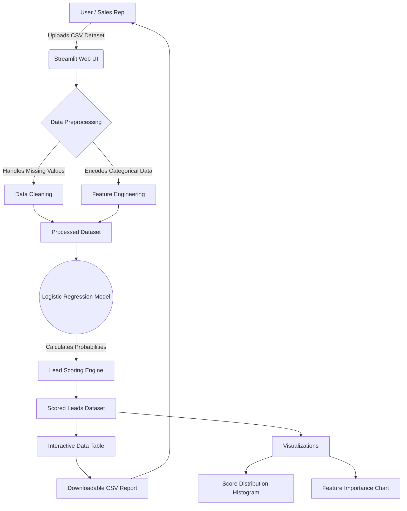

<div align="center">
  

  <h1>🧠 LeadGen AI Enhancer</h1>
  <p><strong>An AI-Powered Lead Scoring System built with Streamlit & Machine Learning</strong></p>

  <p>
    <a href="https://github.com/Rupeshbhardwaj002/LeadGen_AI_Enhancer/stargazers"></a>
    <a href="https://github.com/Rupeshbhardwaj002/LeadGen_AI_Enhancer/network/members"></a>
    <a href="https://github.com/Rupeshbhardwaj002/LeadGen_AI_Enhancer/issues"></a>
    <a href="https://github.com/Rupeshbhardwaj002/LeadGen_AI_Enhancer/blob/main/LICENSE"></a>
  </p>
</div>

---

## 📖 Overview

**LeadGen AI Enhancer** is an intelligent, interactive web application designed to revolutionize how sales and marketing teams prioritize their prospects. By leveraging **Logistic Regression**, this tool automatically processes lead data, calculates conversion probabilities (Lead Scores), and provides actionable visual insights—all through a clean, user-friendly **Streamlit** interface.

Stop guessing which leads will convert and start making data-driven decisions!

---

## 🏗️ Architecture & Data Flow

The following diagram illustrates the end-to-end flow of data through the LeadGen AI Enhancer system:



---

## ✨ Key Features

- **📂 Seamless Data Ingestion**: Upload any `.csv` file containing lead data. The system automatically detects and handles numeric and text-based fields.
- **🎯 Predictive Lead Scoring**: Generates a highly accurate lead conversion probability (Lead Score %) using a trained Logistic Regression model.
- **📊 Interactive Visualizations**: 
  - **Lead Score Distribution**: Understand the overall quality of your lead pool via histograms.
  - **Feature Importance**: Discover exactly *which* factors are driving conversions.
- **🎛️ Dynamic UI**: Filter, sort, and summarize leads directly within the web interface.
- **📥 Export Ready**: Download the scored and enriched dataset as a CSV for immediate use in your CRM or email marketing tools.

---

## 🛠️ Tech Stack

| Component | Technology Used |
| :--- | :--- |
| **Frontend UI** |  |
| **Machine Learning** |  (Logistic Regression) |
| **Data Manipulation** |   |
| **Data Visualization** |  |

---

## 🚀 Installation & Setup

Follow these steps to get the project running on your local machine.

### 1️⃣ Clone the Repository
```bash
git clone https://github.com/Rupeshbhardwaj002/LeadGen_AI_Enhancer.git
cd LeadGen_AI_Enhancer
```

### 2️⃣ Create a Virtual Environment
It is highly recommended to use a virtual environment to manage dependencies.

**For Windows:**
```bash
python -m venv venv
venv\Scripts\activate
```

**For Mac/Linux:**
```bash
python3 -m venv venv
source venv/bin/activate
```

### 3️⃣ Install Dependencies
```bash
pip install -r requirements.txt
```

---

## 💻 Usage Guide

1. **Start the Application**:
   ```bash
   streamlit run app.py
   ```
2. **Access the UI**: Open your browser and navigate to the local URL provided in the terminal (typically `http://localhost:8501`).
3. **Upload Data**: Drag and drop your lead dataset (`.csv`) into the upload widget.
4. **Analyze**: 
   - View the generated Lead Score Table.
   - Explore the Lead Score Distribution and Feature Importance charts.
5. **Export**: Click the download button to save your scored leads.

---

## 📁 Project Structure

```text
LeadGen_AI_Enhancer/
│
├── app.py                 # Main Streamlit application script
├── requirements.txt       # Python dependencies
├── README.md              # Project documentation
├── .gitignore             # Git ignore rules
└── assets/                # Images and static assets
```

---

## 🔮 Future Enhancements

- [ ] **Advanced Filtering**: Add top-lead filtering (e.g., Lead Score > 80%).
- [ ] **Summary Dashboard**: Display quick stats (average, min, max scores).
- [ ] **UI Customization**: Add options to customize themes, backgrounds, and logos.
- [ ] **Model Selection**: Allow users to compare models (e.g., RandomForest, XGBoost vs. Logistic Regression).

---

## 🧑‍💻 Author

**Rupesh Bhardwaj**  
🎓 B.Tech in Computer Science (AI & ML Specialization)  
📍 Passionate about building real-world ML solutions.  
🔗 [GitHub Profile](https://github.com/Rupeshbhardwaj002)

---

## 📜 License

This project is released under the [MIT License](LICENSE).

---
<div align="center">
  <i>If you found this project helpful, please consider giving it a ⭐ on GitHub!</i>
</div>

